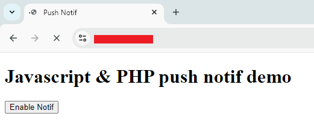
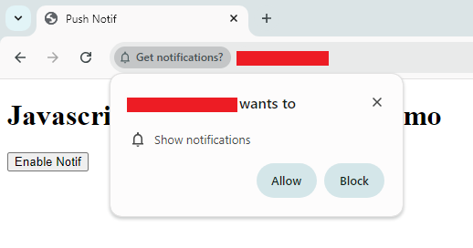
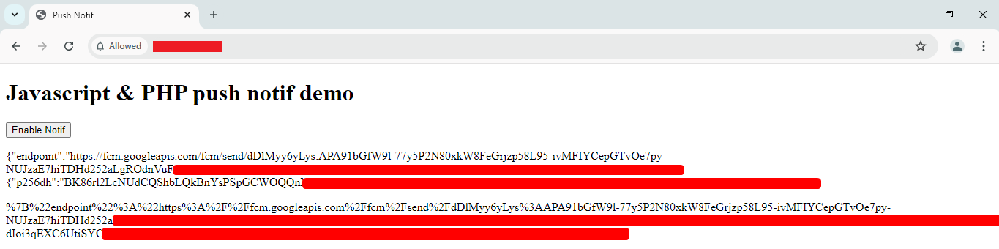
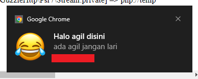

# Notification using fcm with php

⚠ Make sure you already install

<li> Composer <br><br>

⚠ If you dont have hosting server, you can use this for local server

<li> XAMPP
<li> Laragon <br><br>

⚠ Make sure your php version is >= 8.2

## Setup the folder vendor

Downlaod the [vendor.zip](https://) and extract, if you using hosting server just upload the zip and extract with script [php-unzipper](https://github.com/Agellls/php-unzipper)

After that run script [VAPID.php]() in terminal like this :

```php
//make you already inside directory of this file
php VAPID.php
```

The output that script is like :

```php
[publicKey] => BGqoaIRHEkppgVKPv2ReZMV7YbJS_xxxxxxxxxxxxxxxx
[privateKey] => 1tbvzTeoSMP6bWQ0O_xxxxxxxxxxxxxxxxx
```

Make sure you save that public key and private key

## Configure your index key & send key

You can edit [index.html]() like you want. not like my example. but you need change this line with you previus public key

```js
sw.pushManager.subscribe({
  userVisibleOnly: true,
  applicationServerKey: "#ChangeWithYourPublicKey",
});
```

Now edit the file [send.php]() and report notification

```php
$auth = [
    'VAPID' => [
        'subject' => 'mailto:#ChangeWithYourEmail',
        'publicKey' => '#ChangeWithYourPublicKey',
        'privateKey' => '#ChangeWithYourPrivateKey',
    ],
];
```

```php
$report = $webPush->sendOneNotification(
    Subscription::create($subscriptionData),
    json_encode([
        "title" => "#YourTitleNotif",
        "body" => "#YourTitleNotif",
        "url" => "#InpuYourLinkRedirectNotif",
        "delay" => $delayInSeconds // Delay in seconds
    ]),
    ['TTL' => 5000]
);
```

The setup for notificaiton ready now, the next is how to call or show the notif on user

# Get subcription notification

Now open your index.html it will show like this


Then click enable notif it will need permision notif like this


Just click allow or enable, the output index will be show like this


Copy the text on bottom, we need that for send the notification to user

# Show or send notification to user

Just call the file [send.php]() like this :

https://#YourDomainOrLocalhost/send.php?time=5&alert=#YourSubscriptionText

```js
// this for defined when the notif show in users
time = 5  // in this case i used 5, it mean 5 second

// this for defined where notif send to users
alert = #YourSubscriptionText //just copy the subscription from index here
```

Will be show notif like this<br>


You can change the icon with your logo or design just change icon.png

and boom thats its, Happy Cooding 😁👍
